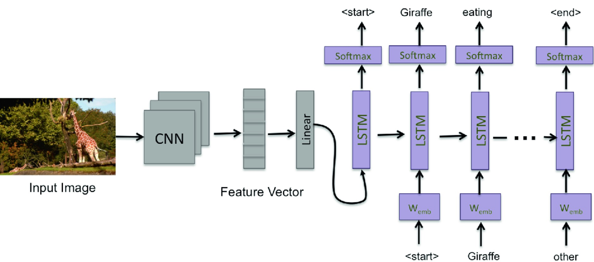

# Image Captioning Using Encoder-Decoder Architecture

I write this code for the purpose of learning. 

All the code and comments are in Image_Captioning.ipynb.

### 1. Dependency
1. pytorch 1.2
2. torchvision
3. numpy
4. matplotlib
5. nltk

### 2. Introduction:

Simply, the encoder will take the image as input and encode it into a vector of feature values. The decoder will take this output from encoder as hidden state and starts to predict next words at each step. The following figure illustrates this:

Figure 1. An overview of the encoder-decoder architecture
(image credit: <a href="https://link.springer.com/chapter/10.1007/978-3-030-04780-1_23">Deep Neural Network Based Image Captioning</a>)

Use a pre-trained CNN as the encoder and Vanilla RNN/LSTM as decoder to predict the captions.